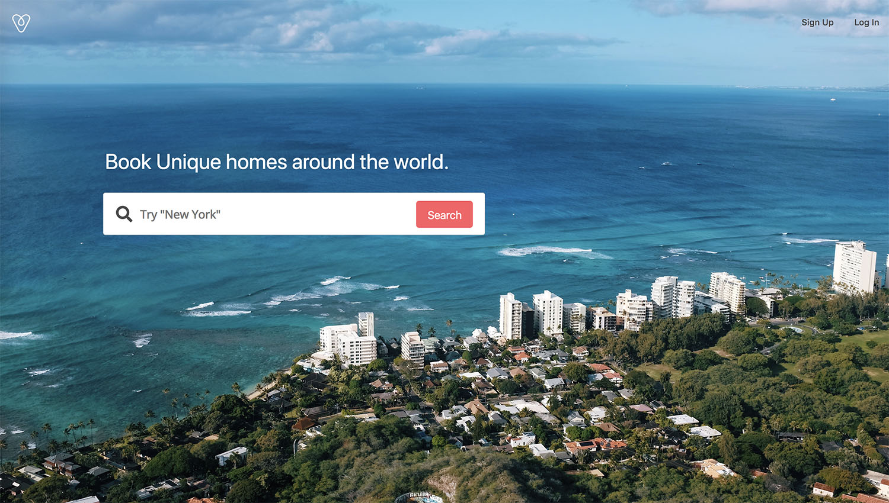
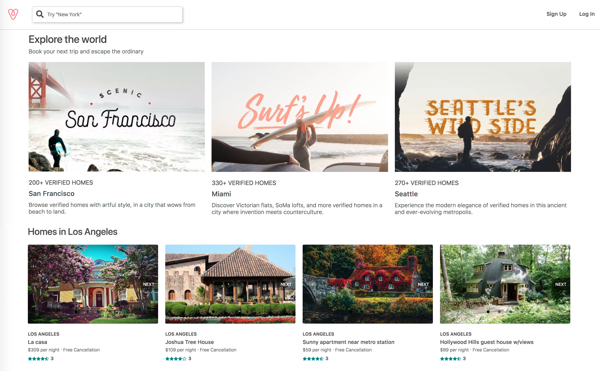
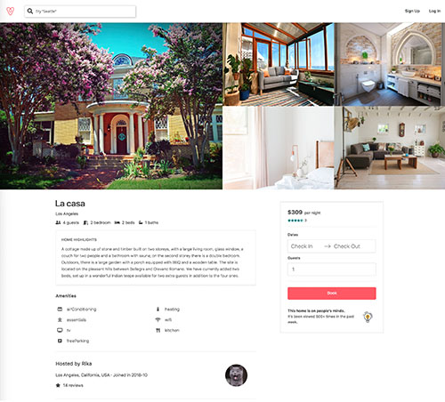
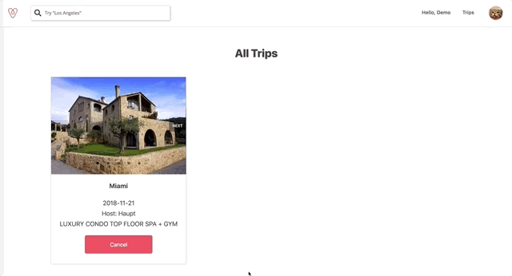

# Airquq

..[Airquq Live Link](https://airquq.herokuapp.com/)..

Airquq is a full-stack, single-page application inspired by Airbnb. It utilizes a Ruby on Rails backend with a PostgreSQL database and a React and Redux frontend. It features four cities with comfortable homes that users can view, book and read reviews. Users can search for homes by location and apply price filter to find the best matches for them.

## Technologies uesd

- Javascript
- Ruby on Rails
- PostgreSQL
- React / Redux
- HTML / CSS

## Features

- Maintain user authenticiation security from frontend to backend
- Display all homes in an organized layout
- Users can search homes by location, view homes on google map using GoogleMap API, and filter results by price range
- Users can view homes' detail information and choose a date range to book
- Users can see all their trips(bookings)

### Homepage

The splash page features a search bar that is built using Google Place Autocomplete. The search bar component also utilizes Google Geocoding API to turn location into geography coordinates.

### Search Result page

This page is for users to search and views listings based on map locations and filter search results by price range.

The backend is only queried for listings within the current map bounds. Any user movement of the map will query the backend based on the updated map bounds.

### Listing index page

Any time user clicks on the logo on the left top corner, user will be directed to the listing index page which shows recommendations for travel destination and homes in those cities. There are quick links to go to the cities Airquq have listings in.

### Listing Show Page

This is the page for users to view all the detailed information of a Airquq listed home, consisting of descriptions, availability, location, and reviews.

Users can book their trip throught the calendar.

### Trips page

This page shows all of the current user's trips(bookings), user can cancel their trips on this page.

## Possible future features

- Messages and chat bot
